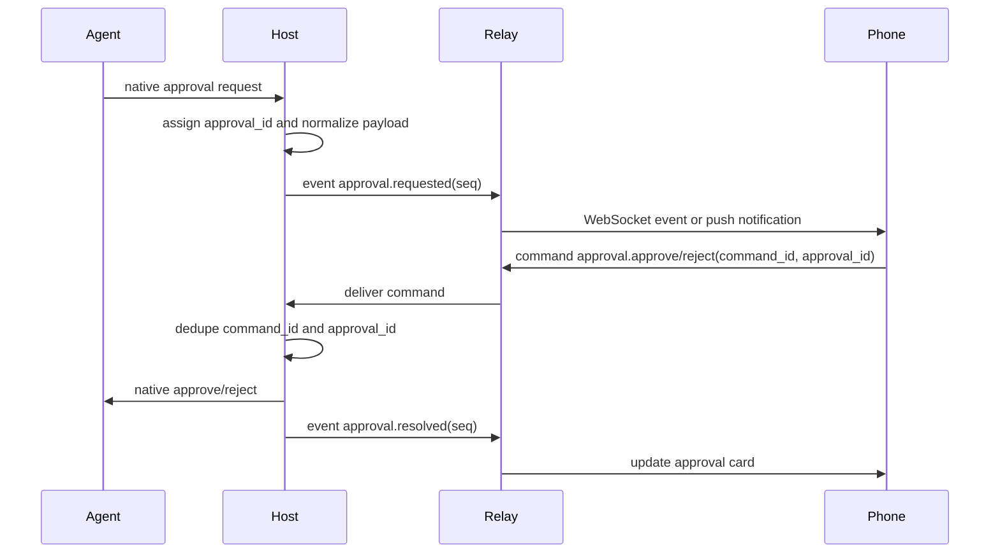
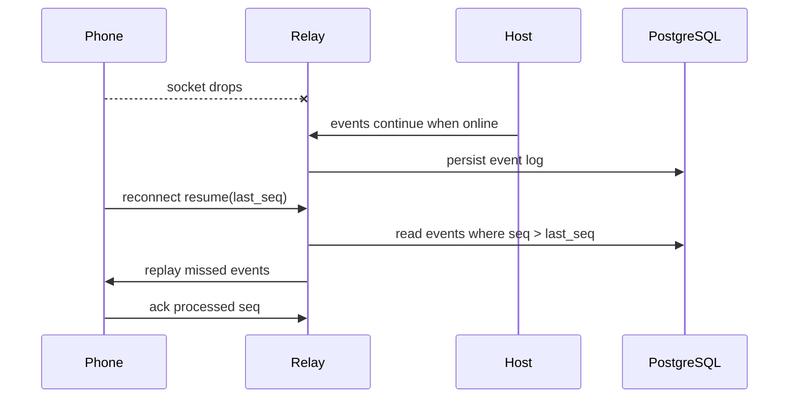

# 关键流程 / Critical Flows

Context Doc Type: critical-flows
Owner: project coordinator
Last Verified: 2026-05-31
Confidence: medium

## Flow Index

| Flow ID | Name | Trigger | Services | Business Impact | Source Evidence | Last Verified | Confidence |
| --- | --- | --- | --- | --- | --- | --- | --- |
| FLOW-001 | Pair phone with Host | User runs `agentpal pair` and scans QR code | mobile-app, relay, host, auth | Establishes trusted control path. | `product-brief.md`, `realtime-sync-model.md` | 2026-05-31 | medium |
| FLOW-002 | Start managed session | User starts an agent from Host CLI or mobile workspace action | mobile-app, relay, host, adapter-* | Creates live controllable agent session. | `host-session-model.md`, `agent-adapter-contract.md` | 2026-05-31 | medium |
| FLOW-003 | Resume historical session | User selects a workspace historical session and resumes it | mobile-app, relay, host, adapter-* | Turns resumable history into managed live session. | `host-session-model.md` | 2026-05-31 | medium |
| FLOW-004 | Approval from phone | Underlying agent requests approval | mobile-app, relay, host, adapter-* | Allows user to unblock agent away from computer. | `agent-adapter-contract.md`, `realtime-sync-model.md` | 2026-05-31 | medium |
| FLOW-005 | Reconnect and replay | Mobile or Host reconnects after network/background interruption | mobile-app, relay, host | Prevents lost events and duplicate commands. | `realtime-sync-model.md` | 2026-05-31 | medium |
| FLOW-006 | Command/skill picker | User types `/` or `$` in mobile input | mobile-app, relay, host, adapter-* | Preserves CLI command affordances with mobile-native UI. | `agent-adapter-contract.md`, `ux-principles.md` | 2026-05-31 | medium |

## FLOW-004 Phone Approval Sequence

## FLOW-005 Reconnect And Replay

