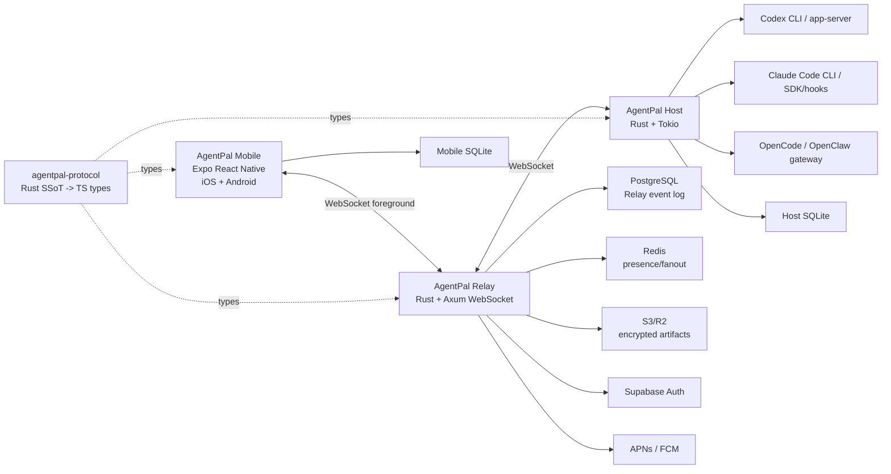

# 系统图谱 / System Map

Context Doc Type: system-map
Owner: project coordinator
Last Verified: 2026-05-31
Confidence: medium

## Scope

This map covers the planned AgentPal product boundary: mobile apps, cloud Relay,
desktop Host, agent adapters, underlying coding agent tools, and durable stores.
Payload schemas and adapter-specific protocol details belong in
`context/integrations/`.

## Mermaid Map

## Map Evidence

| Node | Meaning | Source Evidence | Last Verified | Confidence |
| --- | --- | --- | --- | --- |
| AgentPal Mobile | Native mobile workbench for iOS and Android. | `technical-stack-decision.md` | 2026-05-31 | medium |
| AgentPal Relay | Cloud realtime and routing service. | `realtime-sync-model.md` | 2026-05-31 | medium |
| AgentPal Host | Desktop daemon/CLI that owns process and adapter execution. | `host-session-model.md` | 2026-05-31 | medium |
| Agent adapters | Codex, Claude Code, OpenCode/OpenClaw protocol bridges. | `agent-adapter-contract.md` | 2026-05-31 | medium |
| Durable stores | Event log, local cache, artifact storage. | `realtime-sync-model.md` | 2026-05-31 | medium |
