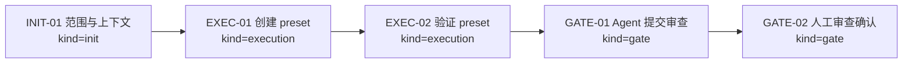
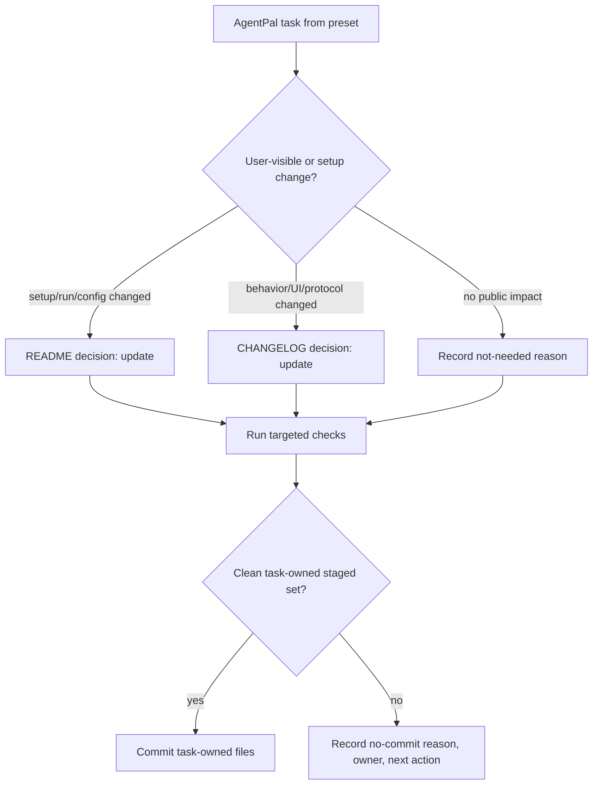

# Visual Map / 可视化图谱

Visual Map Contract: v1.0

## 图表索引（Map Index）

| ID | Type | Purpose | Required For Understanding | Source Evidence | Promotion Candidate |
| --- | --- | --- | --- | --- | --- |
| MAP-01 | phase | 展示 preset 落地、验证和收口门禁 | yes | `task_plan.md` | no |
| MAP-02 | decision | 展示 README / CHANGELOG / commit 决策如何进入 preset | yes | user approval, `task_plan.md` | no |

## 阶段关系图（Phase Graph）

## 决策图（Closeout Decision Map）

## 阶段表（Phase Table，表头供 checker 解析）

| Phase ID | Kind | Depends On | State | Completion | Output | Required Evidence | Exit Command | Actor | Evidence Status | Blocking Risk | Owner / Handoff |
| --- | --- | --- | --- | ---: | --- | --- | --- | --- | --- | --- | --- |
| INIT-01 | init | none | done | 100 | 任务计划和执行策略已确认，worker 不需要 | `task_plan.md`; `execution_strategy.md` | `harness task-start 2026-06-04-agentpal-reusable-task-presets-92745a25` | agent | present | none | coordinator |
| EXEC-01 | execution | INIT-01 | done | 100 | AgentPal preset 包已创建 | preset manifests and templates | `harness task-phase 2026-06-04-agentpal-reusable-task-presets-92745a25 EXEC-01 --state done --completion 100 --evidence present` | agent | present | 当前仓库已有无关 dirty，提交边界必须隔离 | coordinator |
| EXEC-02 | execution | EXEC-01 | done | 100 | CLI preset check 和 smoke task 验证通过 | `harness preset check`; actual smoke target; `status/task-index/check` | `harness task-phase 2026-06-04-agentpal-reusable-task-presets-92745a25 EXEC-02 --state done --completion 100 --evidence present` | agent | present | current repo dirty state remains unrelated | coordinator |
| GATE-01 | gate | EXEC-02 | review | 100 | Agent Review Submission material ready; stale dirty blocker accepted as historical residual | `review.md`、progress update、lesson routing | `harness task-review 2026-06-04-agentpal-reusable-task-presets-92745a25 --message "AgentPal reusable task presets ready"` | agent | present | preset distribution boundary remains local-only unless user requests shared packaging | coordinator |
| GATE-02 | gate | GATE-01 | planned | 0 | Human Review Confirmation | review packet 和人工确认 | `harness review-confirm 2026-06-04-agentpal-reusable-task-presets-92745a25 --confirm 2026-06-04-agentpal-reusable-task-presets-92745a25` | human | missing | Agent 不能代办人工确认 | human |

允许的 `State`：`planned`, `in_progress`, `review`, `blocked`, `done`, `skipped`。

允许的 `Evidence Status`：`missing`, `partial`, `present`, `waived`。

允许的 `Kind`：`init`, `execution`, `gate`。

允许的 `Actor`：`agent`, `human`, `coordinator`。

`Completion` 使用 `0..100` 的整数；`done` 应为 `100`，`planned` 应为 `0`，`skipped` 不计入 dashboard 总完成度。
