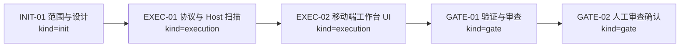
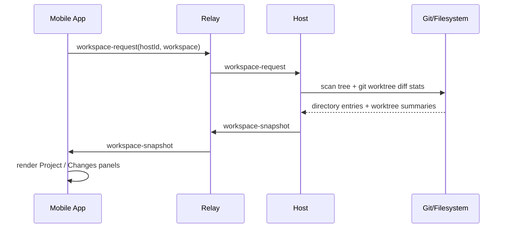

# Visual Map / 可视化图谱

Visual Map Contract: v1.0

## 图表索引（Map Index）

| ID | Type | Purpose | Required For Understanding | Source Evidence | Promotion Candidate |
| --- | --- | --- | --- | --- | --- |
| MAP-01 | phase | 展示执行阶段和依赖关系 | yes | `task_plan.md` | no |
| MAP-02 | data-flow | 展示 workspace snapshot 从 Host 到 App 的数据流 | yes | `crates/protocol/src/lib.rs` | no |

## 阶段关系图（Phase Graph）

## 数据流图

## 阶段表（Phase Table，表头供 checker 解析）

| Phase ID | Kind | Depends On | State | Completion | Output | Required Evidence | Exit Command | Actor | Evidence Status | Blocking Risk | Owner / Handoff |
| --- | --- | --- | --- | ---: | --- | --- | --- | --- | --- | --- | --- |
| INIT-01 | init | none | done | 100 | 任务设计和边界已记录 | `task_plan.md`; `execution_strategy.md` | `harness task-start 2026-06-05-agentpal-project-tree-and-worktree-diff-visibili-9aceaeb2` | agent | present | none | coordinator |
| EXEC-01 | execution | INIT-01 | done | 100 | 协议、Relay 转发、Host 扫描实现 | `cargo fmt --all`; `cargo check --workspace`; live WebSocket probe | `harness task-phase 2026-06-05-agentpal-project-tree-and-worktree-diff-visibili-9aceaeb2 EXEC-01 --state done --completion 100 --evidence present` | agent | present | none | coordinator |
| EXEC-02 | execution | EXEC-01 | done | 100 | 移动端项目/变更工作台 UI | `npm --prefix apps/mobile run typecheck`; Expo iOS export | `harness task-phase 2026-06-05-agentpal-project-tree-and-worktree-diff-visibili-9aceaeb2 EXEC-02 --state done --completion 100 --evidence present` | agent | present | none | coordinator |
| GATE-01 | gate | EXEC-02 | blocked | 90 | Agent Review Submission manually recorded | `review.md`、progress update、lifecycle blocker note | `harness task-review 2026-06-05-agentpal-project-tree-and-worktree-diff-visibili-9aceaeb2 --message "
"` | agent | present | `task-start` failed because governance sync owned path is already dirty | coordinator |
| GATE-02 | gate | GATE-01 | planned | 0 | Human Review Confirmation | review packet 和人工确认 | `harness review-confirm 2026-06-05-agentpal-project-tree-and-worktree-diff-visibili-9aceaeb2 --confirm 2026-06-05-agentpal-project-tree-and-worktree-diff-visibili-9aceaeb2` | human | missing | Agent 不能代办人工确认；blocked until lifecycle dirty state is separated or waived | human |

允许的 `State`：`planned`, `in_progress`, `review`, `blocked`, `done`, `skipped`。

允许的 `Evidence Status`：`missing`, `partial`, `present`, `waived`。

允许的 `Kind`：`init`, `execution`, `gate`。

允许的 `Actor`：`agent`, `human`, `coordinator`。

`Completion` 使用 `0..100` 的整数；`done` 应为 `100`，`planned` 应为 `0`，`skipped` 不计入 dashboard 总完成度。
