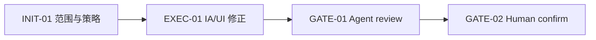
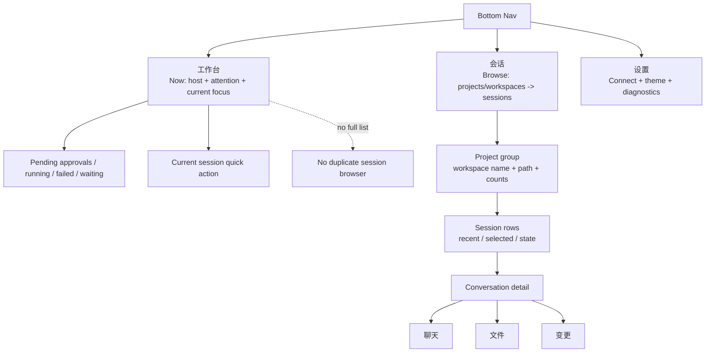

# Visual Map / 可视化图谱

Visual Map Contract: v1.0

## 图表索引（Map Index）

| ID | Type | Purpose | Required For Understanding | Source Evidence | Promotion Candidate |
| --- | --- | --- | --- | --- | --- |
| MAP-01 | phase | 展示任务阶段和 gate | yes | `task_plan.md` | no |
| MAP-02 | architecture | 展示顶层页面职责边界 | yes | 用户截图、Codex desktop 参考 | no |

## 阶段关系图（Phase Graph）

## 阶段表（Phase Table，表头供 checker 解析）

| Phase ID | Kind | Depends On | State | Completion | Output | Required Evidence | Exit Command | Actor | Evidence Status | Blocking Risk | Owner / Handoff |
| --- | --- | --- | --- | ---: | --- | --- | --- | --- | --- | --- | --- |
| INIT-01 | init | none | done | 100 | 任务计划和执行策略已确认 | `task_plan.md`; `execution_strategy.md` | `harness task-start 2026-06-06-agentpal-mobile-workbench-and-sessions-ia-correc-a2978171` | agent | present | none | coordinator |
| EXEC-01 | execution | INIT-01 | done | 100 | 工作台与会话页职责重构 | diff、typecheck、Expo export、Harness check | `harness task-phase 2026-06-06-agentpal-mobile-workbench-and-sessions-ia-correc-a2978171 EXEC-01 --state done --completion 100 --evidence present` | agent | present | 需要保持会话详情入口不回退 | coordinator |
| GATE-01 | gate | EXEC-01 | done | 100 | Agent Review Submission | `review.md`、progress update、lesson routing | `harness task-review 2026-06-06-agentpal-mobile-workbench-and-sessions-ia-correc-a2978171 --message "
"` | agent | present | materials must stay reviewable | coordinator |
| GATE-02 | gate | GATE-01 | planned | 0 | Human Review Confirmation | review packet 和人工确认 | `harness review-confirm 2026-06-06-agentpal-mobile-workbench-and-sessions-ia-correc-a2978171 --confirm 2026-06-06-agentpal-mobile-workbench-and-sessions-ia-correc-a2978171` | human | missing | Agent 不能代办人工确认 | human |

允许的 `State`：`planned`, `in_progress`, `review`, `blocked`, `done`, `skipped`。

允许的 `Evidence Status`：`missing`, `partial`, `present`, `waived`。

允许的 `Kind`：`init`, `execution`, `gate`。

允许的 `Actor`：`agent`, `human`, `coordinator`。

## MAP-02 顶层页面职责

约束：

- `工作台` 是“现在要不要处理”的页面，不能再放完整 session 浏览列表。
- `会话` 是“按项目找 session”的页面，不能再放 Host 大卡和重复指标卡。
- `项目目录` 和 `worktree diff` 属于会话详情，不属于全局会话浏览。
- 顶层导航必须保持三个稳定入口：工作台、会话、设置。
