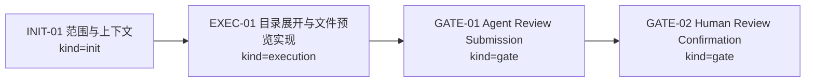
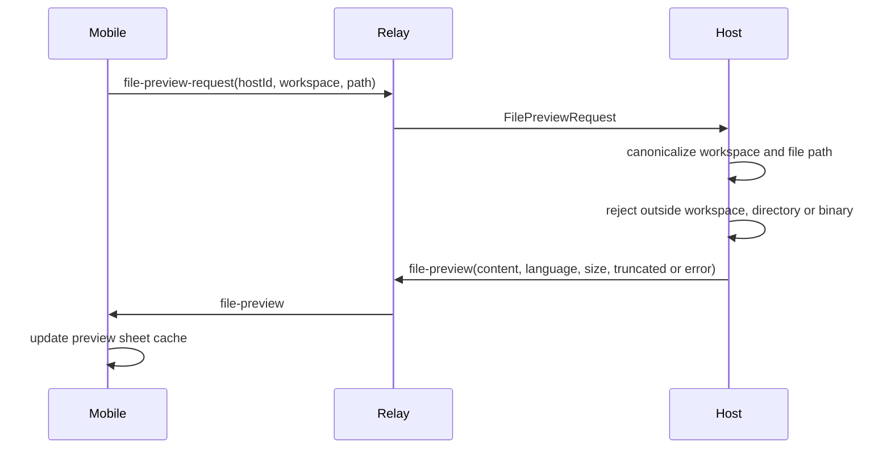

# Visual Map / 可视化图谱

Visual Map Contract: v1.0

## 图表索引（Map Index）

| ID | Type | Purpose | Required For Understanding | Source Evidence | Promotion Candidate |
| --- | --- | --- | --- | --- | --- |
| MAP-01 | phase | 展示实现、验证、agent review 和人工确认 gate 的关系 | yes | `task_plan.md`; `progress.md`; `review.md` | no |

## 阶段关系图（Phase Graph）

## 阶段表（Phase Table，表头供 checker 解析）

| Phase ID | Kind | Depends On | State | Completion | Output | Required Evidence | Exit Command | Actor | Evidence Status | Blocking Risk | Owner / Handoff |
| --- | --- | --- | --- | ---: | --- | --- | --- | --- | --- | --- | --- |
| INIT-01 | init | none | done | 100 | 任务范围、上下文和 subagent 决策已记录 | `task_plan.md`; `execution_strategy.md` | `harness task-start 2026-06-06-agentpal-project-explorer-expand-and-file-previe-393118ff` | agent | present | none | coordinator |
| EXEC-01 | execution | INIT-01 | done | 100 | 目录展开、文件预览协议、Host 读取和移动端预览弹层已实现 | code commit `1888a74`; validation commands; WebSocket probe | `harness task-phase 2026-06-06-agentpal-project-explorer-expand-and-file-previe-393118ff EXEC-01 --state done --completion 100 --evidence present` | agent | present | workspace path safety handled by Host canonicalization | coordinator |
| GATE-01 | gate | EXEC-01 | done | 100 | Agent review submission 已生成，open findings count 为 0 | `review.md`; `progress.md`; `walkthrough.md` | `harness task-review 2026-06-06-agentpal-project-explorer-expand-and-file-previe-393118ff --message "
"` | agent | present | materials must stay reviewable | coordinator |
| GATE-02 | gate | GATE-01 | planned | 0 | 等待用户人工确认手机端项目展开和文件预览体验 | review packet 和人工确认 | `harness review-confirm 2026-06-06-agentpal-project-explorer-expand-and-file-previe-393118ff --confirm 2026-06-06-agentpal-project-explorer-expand-and-file-previe-393118ff` | human | missing | Agent 不能代办人工确认 | human |

允许的 `State`：`planned`, `in_progress`, `review`, `blocked`, `done`, `skipped`。

允许的 `Evidence Status`：`missing`, `partial`, `present`, `waived`。

允许的 `Kind`：`init`, `execution`, `gate`。

允许的 `Actor`：`agent`, `human`, `coordinator`。

`Completion` 使用 `0..100` 的整数；`done` 应为 `100`，`planned` 应为 `0`，`skipped` 不计入 dashboard 总完成度。

## 支持性图表（Supporting Maps）

