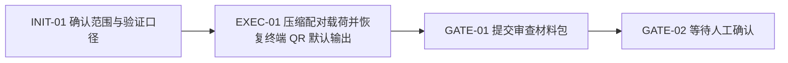

# Visual Map / 可视化图谱

Visual Map Contract: v1.0

本文件描述这次修复的实际生命周期，而不是通用模板。

## 图表索引（Map Index）

| ID | Type | Purpose | Required For Understanding | Source Evidence | Promotion Candidate |
| --- | --- | --- | --- | --- | --- |
| MAP-01 | phase | 展示从默认 QR 修复到审查提交的阶段关系 | yes | `task_plan.md` | no |

## 阶段关系图（Phase Graph）

## 阶段表（Phase Table，表头供 checker 解析）

| Phase ID | Kind | Depends On | State | Completion | Output | Required Evidence | Exit Command | Actor | Evidence Status | Blocking Risk | Owner / Handoff |
| --- | --- | --- | --- | ---: | --- | --- | --- | --- | --- | --- | --- |
| INIT-01 | init | none | done | 100 | 确认默认终端 QR、短配对串和验证范围 | `task_plan.md`; `execution_strategy.md` | `harness task-start 2026-06-11-agentpal-terminal-qr-output-guard-85f60655` | agent | present | none | coordinator |
| EXEC-01 | execution | INIT-01 | done | 100 | 已实现 host / relay / mobile / docs 改动并完成验证 | diff、commands、local smoke、公共 relay healthcheck、单测 | `harness task-phase 2026-06-11-agentpal-terminal-qr-output-guard-85f60655 EXEC-01 --state done --completion 100 --evidence present` | agent | present | npm 发布认证阻塞 | coordinator |
| GATE-01 | gate | EXEC-01 | done | 100 | 已提交 agent review | `review.md`、`progress.md`、`lesson_candidates.md` | `harness task-review 2026-06-11-agentpal-terminal-qr-output-guard-85f60655 --message "
"` | agent | present | missing-materials 已修复 | coordinator |
| GATE-02 | gate | GATE-01 | planned | 0 | 等待人工确认 | review packet 和人工确认 | `harness review-confirm 2026-06-11-agentpal-terminal-qr-output-guard-85f60655 --confirm 2026-06-11-agentpal-terminal-qr-output-guard-85f60655` | human | missing | Agent 不能代办人工确认 | human |

允许的 `State`：`planned`, `in_progress`, `review`, `blocked`, `done`, `skipped`。

允许的 `Evidence Status`：`missing`, `partial`, `present`, `waived`。

允许的 `Kind`：`init`, `execution`, `gate`。

允许的 `Actor`：`agent`, `human`, `coordinator`。

`Completion` 使用 `0..100` 的整数；`done` 应为 `100`，`planned` 应为 `0`，`skipped` 不计入 dashboard 总完成度。

## 支持性图表（Supporting Maps）

- architecture：host 生成配对串，relay 负责分发和 claim，mobile 解析短格式并发起 pair claim。
- sequence：`agentpal pair` -> relay pair-create -> host 打印 QR -> mobile scan/claim -> host 保持连接。
- data-flow：短 `pair_id` / `pair_token` 从 relay 到 host，再到 mobile；默认 public relay URL 仅在非默认场景显式编码。
- state：`planned -> done -> review -> human confirm`。
- topology：单仓，`crates/host`、`crates/relay`、`apps/mobile`、`coding-agent-harness/planning/tasks/...`
